# Crypto Prediction with LSTM, GRU and Bidirectional LSTM

We're taking three coins and 3 models and trying to find out which model is by far the best choice to predict crypto prices.

### Friendly Note

- The code is in colab notebook meaning anyone can use it. 
- The code structure has been made same in all files for ease
- The dataset duration is in from January 1, 2018 to October 8, 2023
- The dataset has been splitted 80% training and testing.
- Since the dataset collected form Yahoo Finance was in good shape, we didn't need much data wrangling and cleaning to do. Yeah! has been min max scaled using sklearn minmaxscaler and preprocessed according to the requirement of RNN.
- Every model is of 5 layers, four RNN layers and fifth Dense layer, with 50 neurons in first layer, 80 neurons in 2nd layer, 80 layers in 3rd layer, and 50 neurons in fourth layer, lastly the Dense layer with one neuron.
- Adam optimizer is used, a descent choice
- Loss function, mean squarred error
- The model has been trained on dataset of batch size of 64 and epochs of 534.
- After training the model has been tested on test dataset, and prediction are inverse transform to get the origninal values of coins. Computing metrics of RMSE and MAPE.

## Experiment 1: Bidirectional LSTM

### On bitcoin

- Data Trend

    

- Model

    Model Architecture for BiLSTM

- loss

    

- Resultant metrics

    - RMSE: 609.24
    - MAPE: 1.82%

- Resultant trend

    

### On Binance

- Data Trend

    

- Model

    Model Architecture for BiLSTM

- loss

    

- Resultant metrics

    - RMSE: 8.34
    - MAPE: 2.00%

- Resultant trend

    

### On Ripple

- Data Trend

    

- Model

    Model Architecture for BiLSTM

- loss

    

- Resultant metrics

    - RMSE: 0.02
    - MAPE: 2.63%

- Resultant trend

    

## Experiment 2: GRU

### On bitcoin

- Data Trend

    

- Model

    Model Architecture for GRU

- loss

    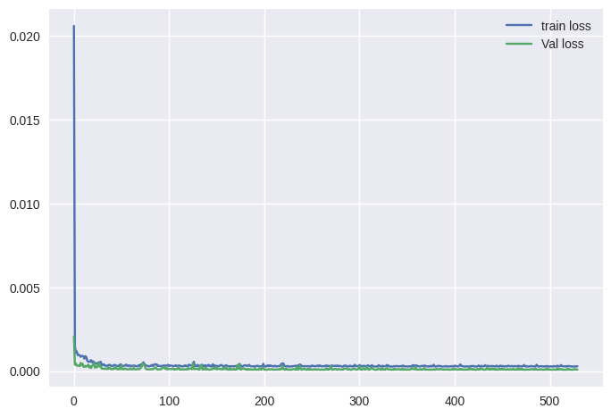

- Resultant metrics

    - RMSE: 621.13
    - MAPE: 1.91%

- Resultant trend

    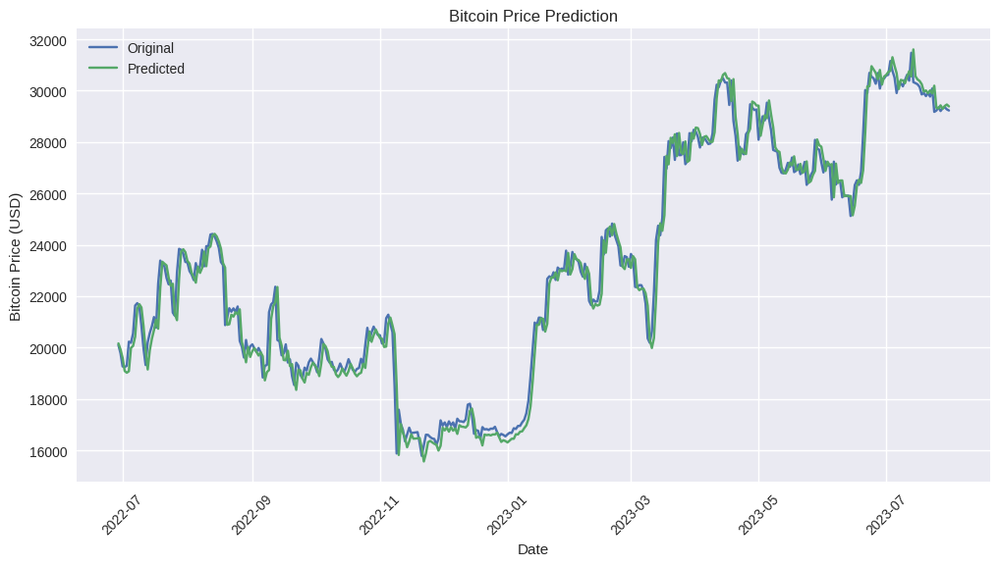

### On Binance

- Data Trend

    

- Model

    Model Architecture for GRU

- loss

    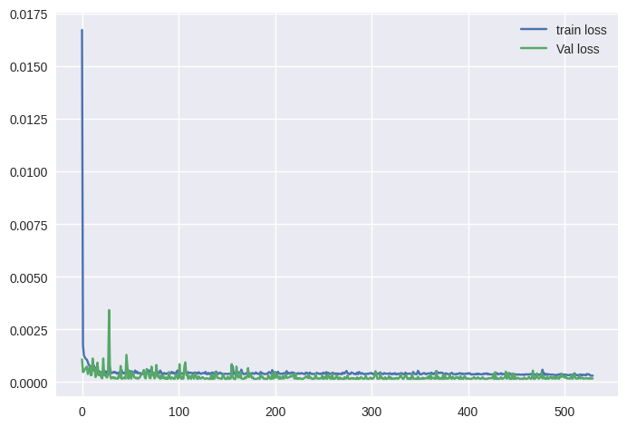

- Resultant metrics

    - RMSE: 8.94
    - MAPE: 2.19%

- Resultant trend

    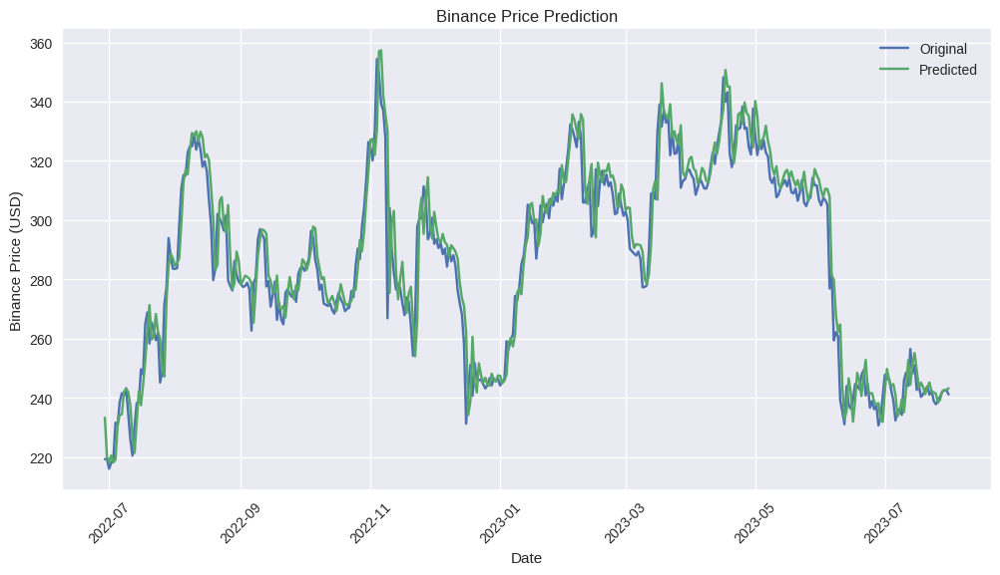

### On Ripple

- Data Trend

    

- Model

    Model Architecture for GRU

- loss

    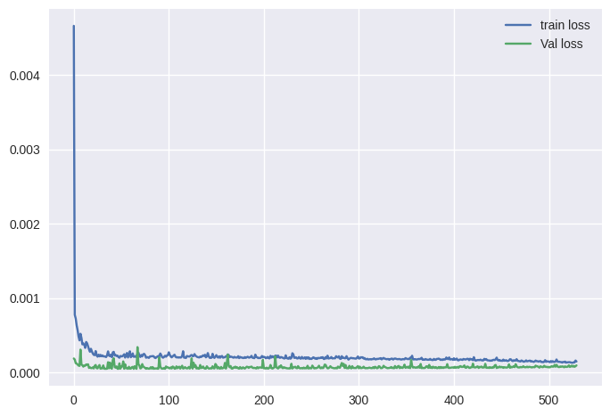

- Resultant metrics

    - RMSE: 0.03
    - MAPE: 3.87%

- Resultant trend

    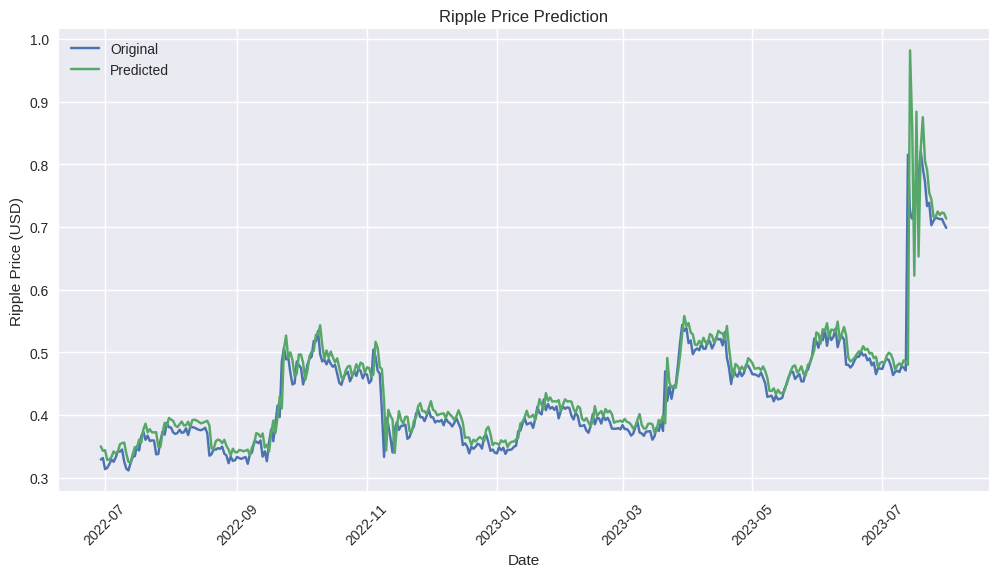

## Experiment 3: LSTM

### On bitcoin

- Data Trend

    

- Model

    Model Architecture for LSTM

- loss

    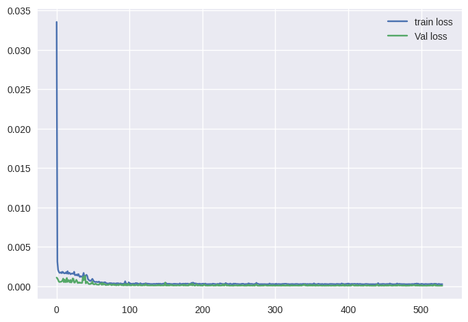

- Resultant metrics

    - RMSE: 613.71
    - MAPE: 1.94%

- Resultant trend

    

### On Binance

- Data Trend

    

- Model

    Model Architecture for LSTM

- loss

    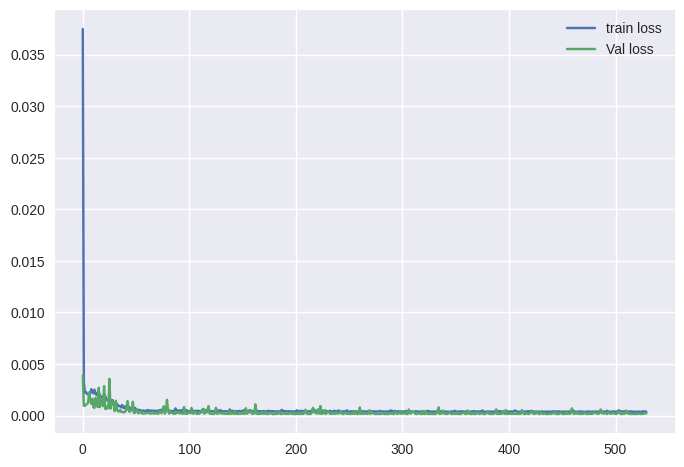

- Resultant metrics

    - RMSE: 9.91
    - MAPE: 2.75%

- Resultant trend

    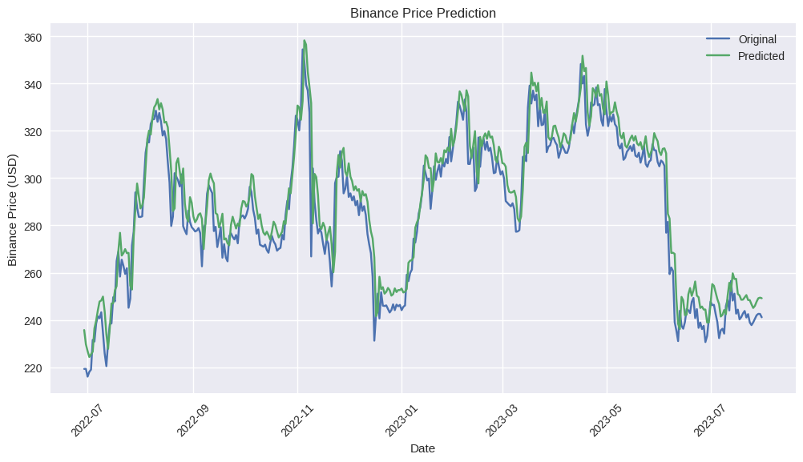

### On Ripple

- Data Trend

    

- Model

    Model Architecture for LSTM

- loss

    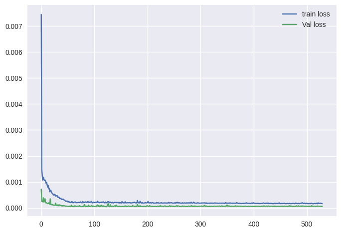

- Resultant metrics

    - RMSE: 0.03
    - MAPE: 2.82%

- Resultant trend

    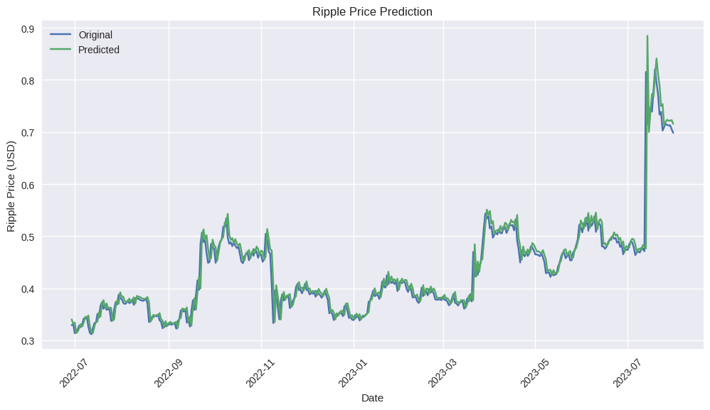

### Report

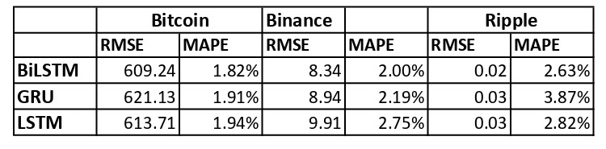

The above report shows that BiLSTM is by far the best model to predict crypto prices.

# Note
Due to randomization of the insider parameters, results might change after every iteration of experiment but the whole controversy of the project remains same.
